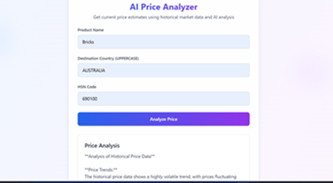
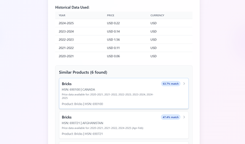

# 🔍 AI Price Analyzer — RAG App with Groq AI

A sophisticated **RAG (Retrieval-Augmented Generation)** application built with **Next.js** that computes **average selling prices** based on historical market data and provides intelligent product recommendations using **vector similarity search**.

---

## 🌐 Live On

👉 [**Launch Site**](https://expo.dev/accounts/vaibhavkalvankar/projects/ExpoDemo/builds/4b3e4b43-1a0d-40ea-8a0b-81d8cf8dd2bc)

---

## 🖼️ Screenshots

### 🔹 Analysis section

### 🔹 Historical Data View

### 🔹 Modal View

---

## ⚙️ Features

- 🤖 **AI-Powered Price Analysis**: Uses Groq AI to analyze historical market data and predict current prices  
- 📈 **Historical Data Integration**: Fetches and analyzes multi-year pricing trends from Supabase  
- 🧠 **Vector Similarity Search**: Finds similar products using embeddings and semantic search  
- 🔍 **Interactive Product Modal**: Detailed view of similar products with comprehensive metadata  
- ⚡ **Real-time Analysis**: Live price estimation with confidence scoring  
- 🎨 **Responsive Design**: Beautiful, mobile-friendly interface with animated backgrounds  
- 🔔 **Toast Notifications**: User-friendly feedback system  

---

## 🧠 Tech Stack

- **Frontend**: Next.js, React, TypeScript  
- **Database**: Supabase (PostgreSQL)  
- **AI/ML**: Groq API for analysis, Vector embeddings for similarity search  
- **Styling**: Tailwind CSS with custom animations
- **State Management**: React Hooks  

---

## 🔌 API Endpoints

### `/api/groq-analyze`

- **Method**: `POST`  
- **Purpose**: Analyze historical data and predict current prices  
- **Payload**: `{ prompt: string }`  
- **Response**: `{ result: string }`  

---

## 🧾 Vector Store Functions

- `storeProductEmbedding(metadata)`: Store product data with embeddings  
- `searchSimilarProducts(query, limit)`: Find similar products  

---

## 📌 Key Features

### 📊 Price Analysis

- Fetches historical data from Supabase  
- Uses Groq AI for intelligent analysis  
- Provides confidence scoring  
- Shows price trends and predictions  

### 🔄 Similar Products

- Vector-based similarity search  
- Filters out exact matches  
- Shows similarity percentages  
- Interactive modal with detailed information  

### 🖥️ User Interface

- Gradient backgrounds with animated blobs  
- Responsive design for all devices  
- Loading states and error handling  
- Toast notifications for user feedback  

---

## ✍️ Author

Created by [Vaibhav Kalvankar]  
📧 [vaibhavkalvankar97@gmail.com]
